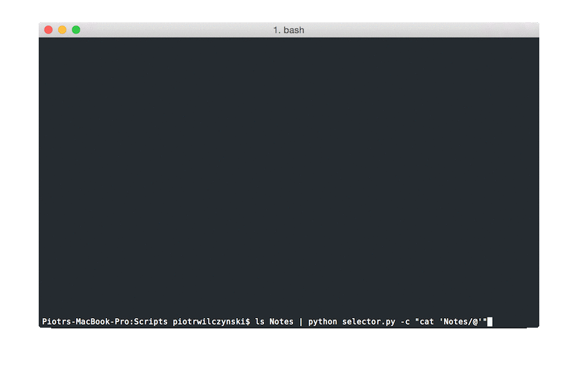

# selector

Little utility to select items from list, written in python with dreadful  curses module.



Inside *selector* you can use arrows to navigate and move caret. Moving caret and deleting words and lines with holding command and alt should work on OSX.

## Using in scripts

`select` is the main function. It accepts function - `options` - that should return list of options to display in selector when provided with text typed by the user. `select` returns named tuple with `index` of the item selected by the user, text of `selected` item, text `typed` by the user and *options* that were visible when user selected one. When user cancels *selector* with escape every value will be `None`.

`options` can be any function you want, but *selector* provides few factories of those functions:

- `options_from_list` - return function that will return items from list that fuzzy match text typed by user
- `options_by_prepending_option` - given other `options` function and other option prepends this to output of `options`
- `options_by_appending_option` - given other `options` function and other option appends this to output of `options`

## Using as standalone utility

Albeit it is mostly meant to be used inside other python scripts **selector** can be used as command line utility with pipes. It even provides some options for situations when your terminal won't play nice with combining pipes and curses:

```
Usage:
    selector.py
    selector.py -f=<filepath>
    selector.py -a=<filepath>
    selector.py -c=<command>
    selector.py -e=<command>

Options:
    -h --help                 Show this screen.
    -f=<filepath> --file      Write selected item as content of file
    -a=<filepath> --append    Append selected item to file
    -c=<command> --command    Execute unix command after replacing "@" with selected item
    -e=<command> --echo       Execute unix command by echoing and pipeing selected item
```

## example.py

Little example application, that lets you search, create and open notes in Vim - is in *example.py*.
