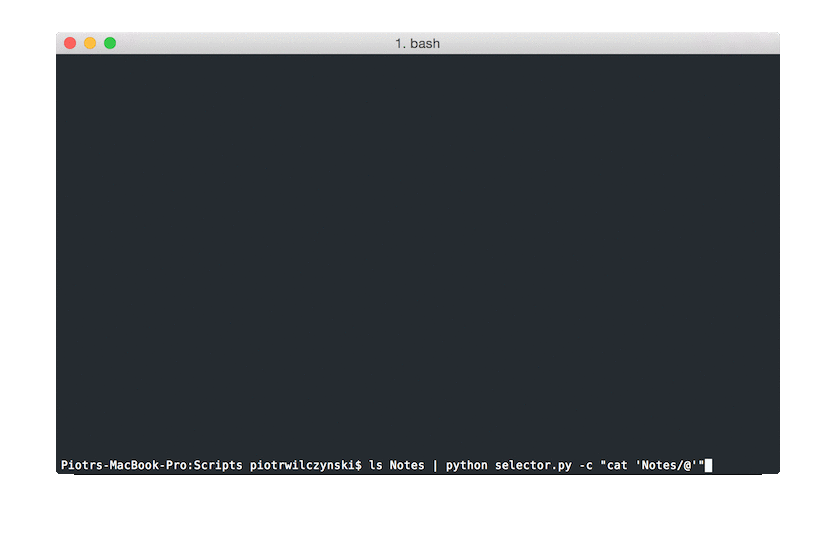

# selector

Little utility to select items from list, written in python with dreadful  curses module.

Albeit it is mostly meant to be used inside other python scripts **selector** can be used as command line utility with pipes. It even provides some options for situations when your terminal won't play nice with combining pipes and curses:



```
Usage:
    selector.py
    selector.py -f=<filepath>
    selector.py -a=<filepath>
    selector.py -c=<command>
    selector.py -e=<command>

Options:
    -h --help                 Show this screen.
    -f=<filepath> --file      Write selected item as content of file
    -a=<filepath> --append    Append selected item to file
    -c=<command> --command    Execute unix command after replacing "@" with selected item
    -e=<command> --echo       Execute unix command by echoing and pipeing selected item
```

Inside *selector* you can use arrows to navigate and move caret. Moving caret and deleting words and lines with holding command and alt should work on OSX.

## Using **selector** in scripts

`select` is the main function. It accepts function - `get_items` - that should return list of items to be displayed in selector when provided with text typed by the user. `select` returns named tuple with `index` of the item selected by the user, text of `selected` item and text `typed` by the user. When user cancels *selector* with escape every value will be `None`.

`get_items` can be any function you want, but *selector* provides few factories of those functions:

- `make_fuzzy_matcher_from_list` - return function that will return items from list that fuzzy match text typed by user
- `append_msg` - given other `get_items` and `msg` appends `msg` to output of `get_items`
- `prepend_msg` - similar to `append_msg`
- `append_msgs` - similar to `append_msg` but accepts multiple `msg`s
- `prepend_msgs` - similar to `append_msgs`

### n.py

Example of what can be done - little application that lets you search, create and open notes in Sublime Text - is in *n.py*.
